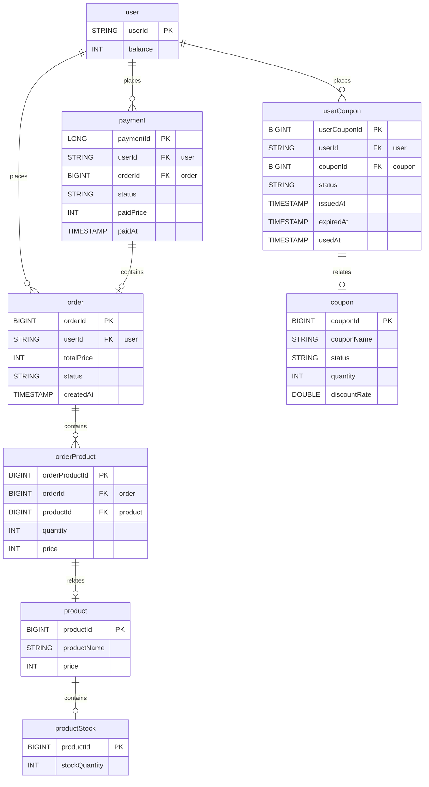

```mermaid
erDiagram
    user{
        STRING userId PK
        INT balance
    }

    product{
        BIGINT productId PK
        STRING productName
        INT price
    }
    
    productStock{
        BIGINT productId PK
        INT stockQuantity
    }

    order{
        BIGINT orderId PK
        STRING userId FK "user"
        INT totalPrice
        STRING status
        TIMESTAMP createdAt
    }

    orderProduct{
        BIGINT orderProductId PK
        BIGINT orderId FK "order"
        BIGINT productId FK "product"
        INT quantity
        INT price
    }

    coupon{
        BIGINT couponId PK
        STRING couponName
        STRING status
        INT quantity
        DOUBLE discountRate
    }

    userCoupon{
        BIGINT userCouponId PK
        STRING userId FK "user"
        BIGINT couponId FK "coupon"
        STRING status
        TIMESTAMP issuedAt
        TIMESTAMP expiredAt
        TIMESTAMP usedAt
    }

    payment {
        LONG paymentId PK
        STRING userId FK "user"
        BIGINT orderId FK "order"
        STRING status
        INT paidPrice
        TIMESTAMP paidAt
    }

    user ||--o{ order : places
    user ||--o{ payment : places
    user ||--o{ userCoupon : places
    order ||--o{ orderProduct : contains
    product ||--o| productStock : contains
    payment ||--o| order : contains
    orderProduct ||--o| product : relates
    userCoupon ||--o| coupon : relates
```