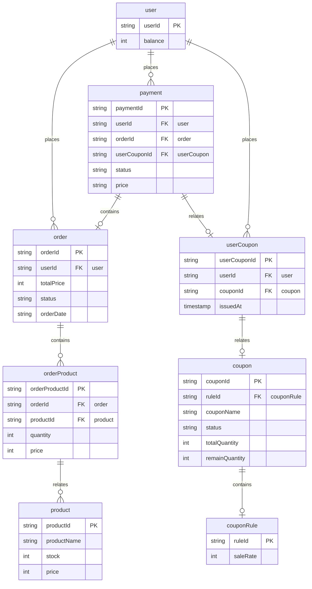

```mermaid
erDiagram
    user{
        string userId PK
        int balance
    }

    product{
        string productId PK
        string productName
        int stock
        int price
    }

    order{
        string orderId PK
        string userId FK "user"
        int totalPrice
        string status
        string orderDate
    }

    orderProduct{
        string orderProductId PK
        string orderId FK "order"
        string productId FK "product"
        int quantity
        int price
    }

    coupon{
        string couponId PK
        string ruleId FK "couponRule"
        string couponName
        string status
        int totalQuantity
        int remainQuantity
    }

    couponRule{
        string ruleId PK
        int saleRate
    }

    userCoupon{
        string userCouponId PK
        string userId FK "user"
        string couponId FK "coupon"
        timestamp issuedAt
    }

    payment {
        string paymentId PK
        string userId FK "user"
        string orderId FK "order"
        string userCouponId FK "userCoupon"
        string status
        string price
    }

    user ||--o{ order : places
    order ||--o{ orderProduct : contains
    orderProduct ||--o{ product : relates

    user ||--o{ payment : places
    payment ||--o| order : contains
    payment ||--o| userCoupon : relates

    user ||--o{ userCoupon : places
    userCoupon ||--o| coupon : relates
    coupon ||--o| couponRule : contains
```