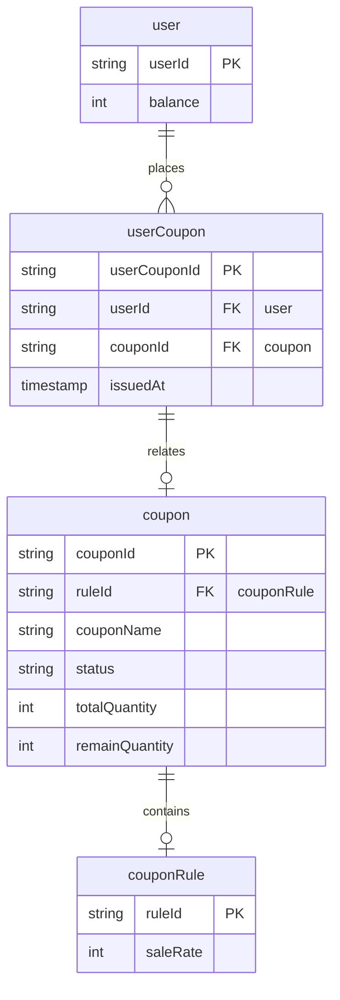

```mermaid
erDiagram
    user{
        string userId PK
        int balance
    }
    coupon{
        string couponId PK
        string ruleId FK "couponRule"
        string couponName
        string status
        int totalQuantity
        int remainQuantity
    }
    couponRule{
        string ruleId PK
        int saleRate
    }
    userCoupon{
        string userCouponId PK
        string userId FK "user"
        string couponId FK "coupon"
        timestamp issuedAt
    }

    user ||--o{ userCoupon : places
    userCoupon ||--o| coupon : relates
    coupon ||--o| couponRule : contains
```