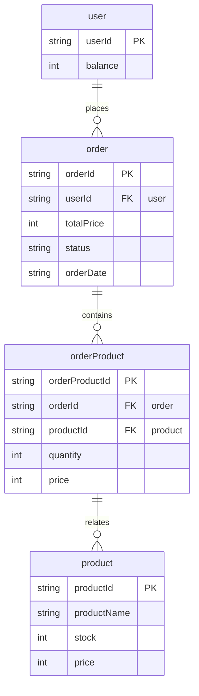

```mermaid
erDiagram
    user{
        string userId PK
        int balance
    }
    order{
        string orderId PK
        string userId FK "user"
        int totalPrice
        string status
        string orderDate
    }
    orderProduct{
        string orderProductId PK
        string orderId FK "order"
        string productId FK "product"
        int quantity
        int price
    }
    product{
        string productId PK
        string productName
        int stock
        int price
    }

    user ||--o{ order : places
    order ||--o{ orderProduct : contains
    orderProduct ||--o{ product : relates
```