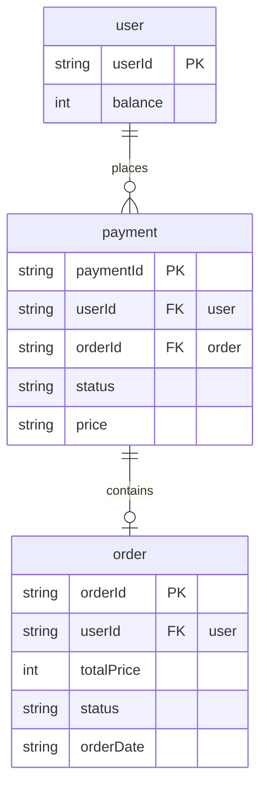

```mermaid
erDiagram
    user{
        string userId PK
        int balance
    }
    order{
        string orderId PK
        string userId FK "user"
        int totalPrice
        string status
        string orderDate
    }
    payment {
        string paymentId PK
        string userId FK "user"
        string orderId FK "order"
        string status
        string price
    }
    

    user ||--o{ payment : places
    payment ||--o| order : contains
```