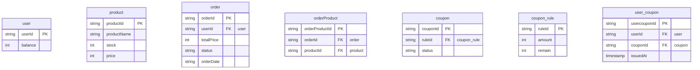

```mermaid
erDiagram
    user{
        string userId PK
        int balance
    }
    product{
        string productId PK
        string productName
        int stock
        int price
    }
    order{
        string orderId PK
        string userId FK "user"
        int totalPrice
        string status
        string orderDate
    }
    orderProduct{
        string orderProductId PK
        string orderId FK "order"
        string productId FK "product"
    }
    coupon{
        string couponId PK
        string ruleId FK "coupon_rule"
        string status 
    }
    coupon_rule{
        string ruleId PK
        int amount
        int remain
    }
    
    user_coupon{
        string usercouponId PK
        string userId FK "user"
        string couponId FK "coupon"
        timestamp issuedAt 
    }
```