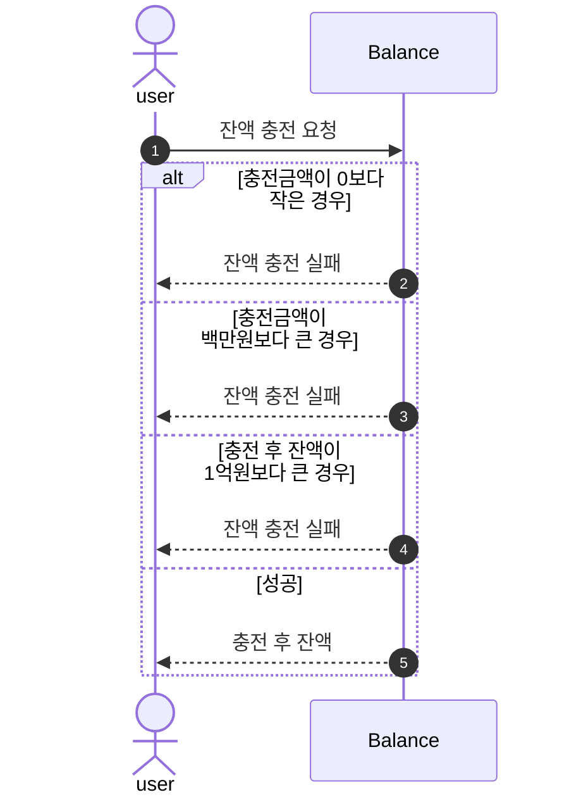
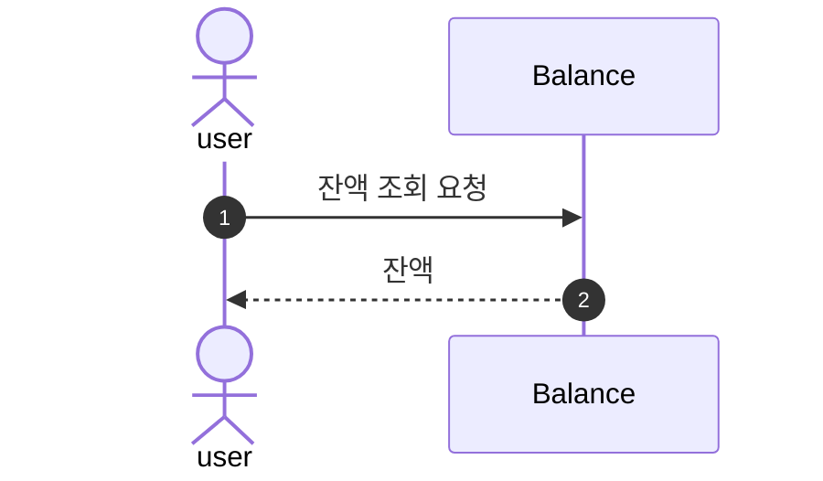
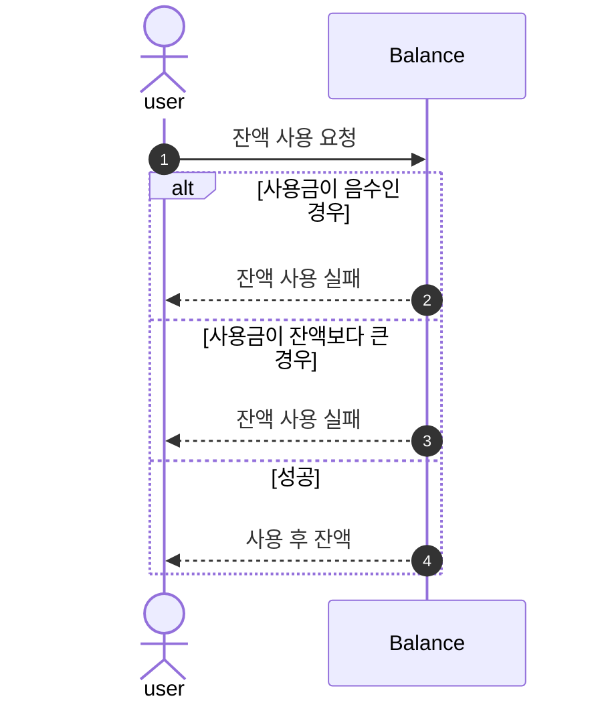

# `잔액` 클래스 다이어그램 
## 1. 잔액 충전

```mermaid
sequenceDiagram
    autonumber
    actor user
    participant Balance
    
    user ->> Balance: 잔액 충전 요청
    alt 충전금액이 0보다 작은 경우
    Balance -->> user: 잔액 충전 실패
    else 충전금액이 백만원보다 큰 경우
      Balance -->> user: 잔액 충전 실패
    else 충전 후 잔액이 1억원보다 큰 경우
      Balance -->> user: 잔액 충전 실패
    else 성공
    Balance -->> user: 충전 후 잔액
    end
```
- - -
## 2. 잔액 조회

```mermaid
sequenceDiagram
    autonumber
    actor user
    participant Balance
    
    user->>Balance: 잔액 조회 요청
    Balance-->>user: 잔액
```
- - -
## 3. 잔액 사용

```mermaid
sequenceDiagram
    autonumber
    actor user
    participant Balance
    
    user->>Balance: 잔액 사용 요청
    alt 사용금이 음수인 경우
    Balance -->> user: 잔액 사용 실패
    else 사용금이 잔액보다 큰 경우
    Balance -->> user: 잔액 사용 실패
    else 성공
    Balance -->> user: 사용 후 잔액
    end
```