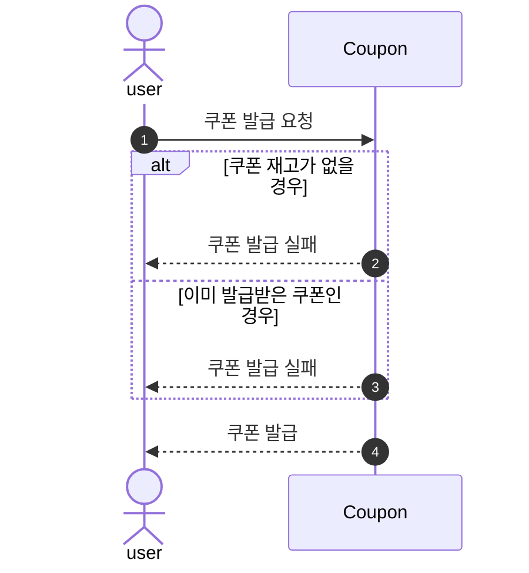
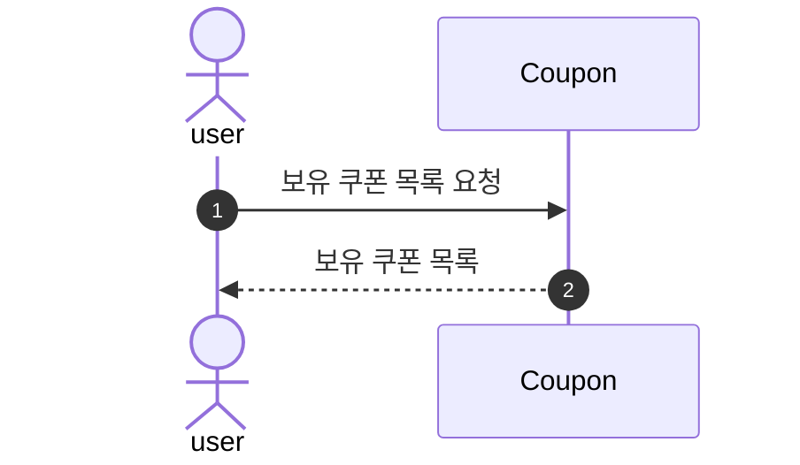

# `쿠폰` 클래스 다이어그램
## 1. 쿠폰 발급

```mermaid
sequenceDiagram
    autonumber
    actor user
    participant Coupon
    user ->> Coupon: 쿠폰 발급 요청
    alt 쿠폰 재고가 없을 경우
        Coupon -->> user: 쿠폰 발급 실패
    else 이미 발급받은 쿠폰인 경우
        Coupon -->> user: 쿠폰 발급 실패
    end
    Coupon -->> user: 쿠폰 발급
```
- - -
## 2. 보유 쿠폰 목록 조회

```mermaid
sequenceDiagram
    autonumber
    actor user
    participant Coupon
    
    user ->> Coupon: 보유 쿠폰 목록 요청
    Coupon -->> user: 보유 쿠폰 목록
```