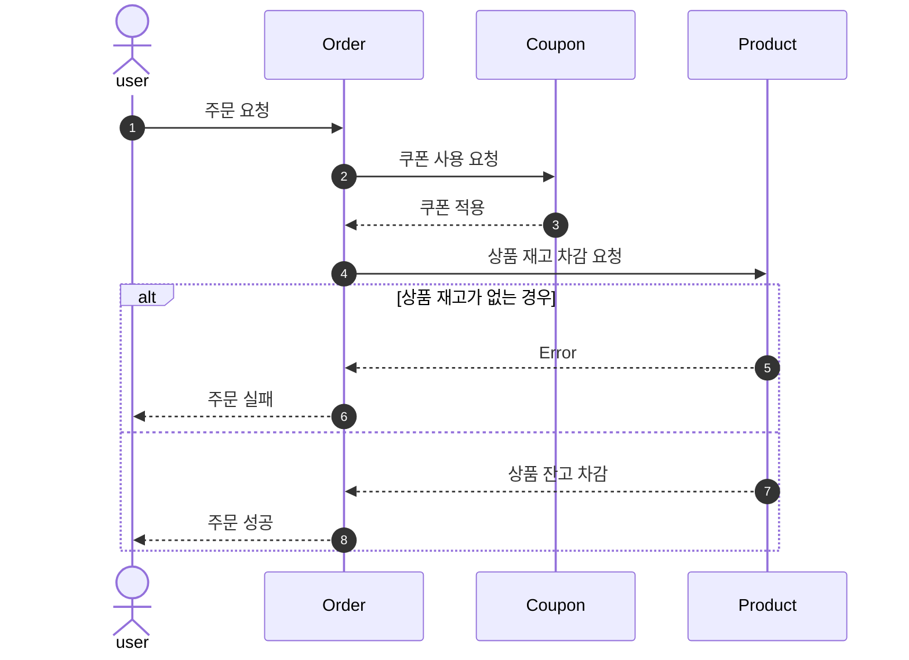

# `주문` 클래스 다이어그램
## 1. 주문

```mermaid
sequenceDiagram
    autonumber
    actor user
    participant Order
    participant Coupon
    participant Product
    
    user->>Order: 주문 요청
    Order->>Coupon: 쿠폰 사용 요청
    Coupon-->>Order: 쿠폰 적용
    Order->>Product: 상품 재고 차감 요청
    alt 상품 재고가 없는 경우
        Product-->>Order: Error
        Order-->>user: 주문 실패
    else
        Product-->>Order: 상품 잔고 차감
        Order-->>user: 주문 성공
    end
```