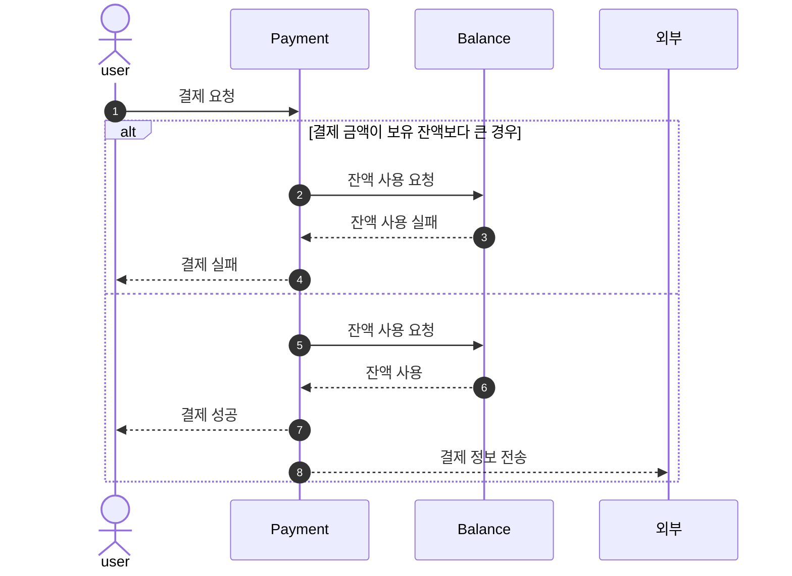

# `결제` 클래스 다이어그램
## 1. 결제

```mermaid
sequenceDiagram
    autonumber
    actor user
    participant Payment
    participant Balance
    participant 외부
    
    user->>Payment: 결제 요청
    alt 결제 금액이 보유 잔액보다 큰 경우
        Payment->>Balance: 잔액 사용 요청
        Balance-->>Payment: 잔액 사용 실패
        Payment-->>user: 결제 실패
    else
        Payment->>Balance: 잔액 사용 요청
        Balance-->>Payment: 잔액 사용
        Payment-->>user: 결제 성공
        Payment-->>외부: 결제 정보 전송
    end
    
```