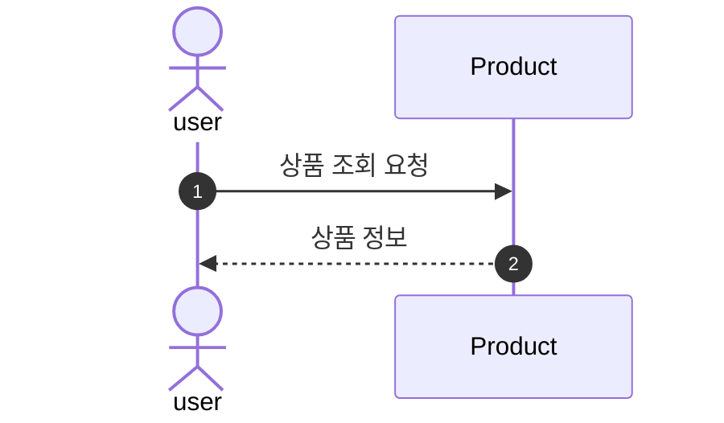
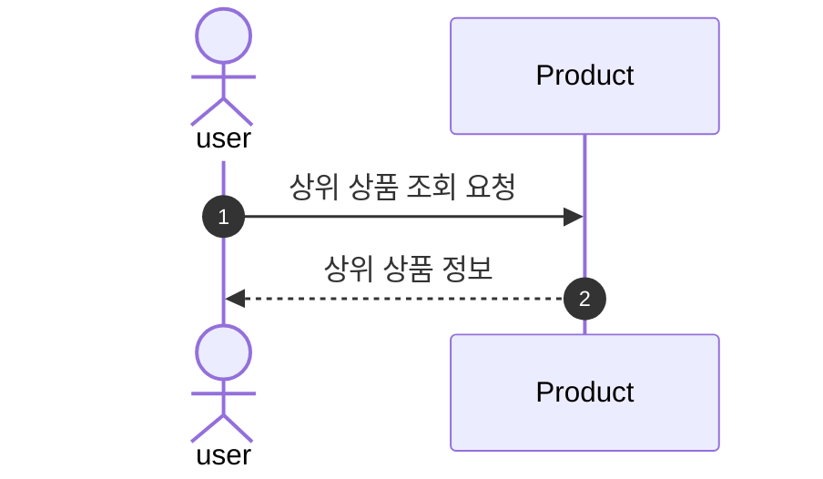

# `상품` 클래스 다이어그램
## 1. 상품 조회

```mermaid
sequenceDiagram
    autonumber
    actor user
    participant Product
    user ->> Product: 상품 조회 요청
    Product -->> user: 상품 정보
```
- - -
## 2. 상위 상품 조회

```mermaid
sequenceDiagram
    autonumber
    actor user
    participant Product
    user ->> Product: 상위 상품 조회 요청
    Product -->> user: 상위 상품 정보
```