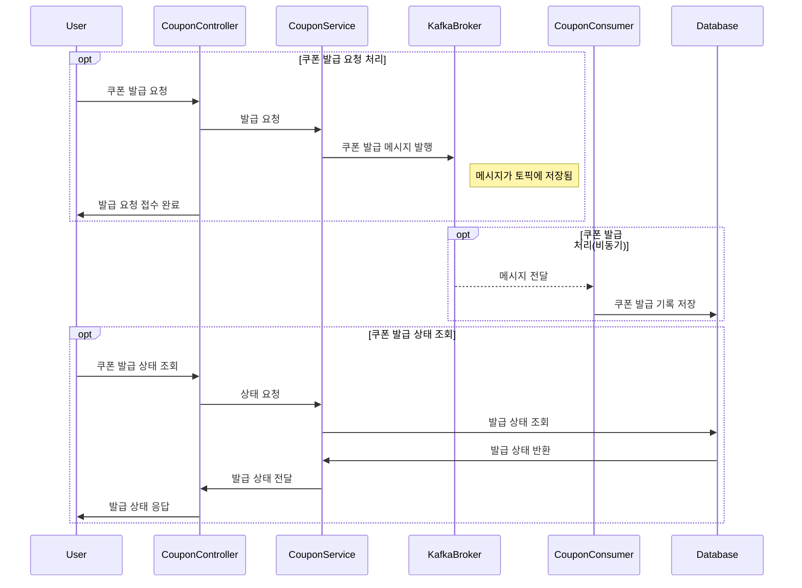

# 쿠폰 발급 프로세스 개선 보고서

## 1. 개요

쿠폰 발급은 대규모 이벤트, 프로모션 등에서 동시다발적으로 발생하는 요청을 처리해야 하는 핵심 프로세스입니다. 현재 시스템은 **Redis 분산락**을 활용하여 중복 발급을 방지하고 있습니다. 그러나 트래픽이 폭증하는 이벤트 상황에서 Redis만으로는 안정성과 확장성에 한계가 드러났습니다.

따라서 Redis 기반 구조의 문제점을 분석하고, **Kafka 기반 아키텍처**로 전환했을 때의 개선 효과와 설계 타당성을 설명합니다. 또한 병렬성, 순차성, 중복처리 전략을 포함한 구체적인 설계 방안을 제시합니다.

---

## 2. 기존 프로세스 구조 및 한계

### 2.1 구조

* 애플리케이션 서버 → Redis 분산락 획득 → 쿠폰 발급 로직 실행 → DB 반영

### 2.2 한계점

1. **과도한 락 경합**

    * 수십만 건 이상의 요청이 짧은 시간 내에 들어오면 Redis에 락 요청이 몰려 지연 발생.
    * 락 획득 실패로 인한 재시도 폭증 → Redis 부하 증가.

2. **확장성의 한계**

    * Redis는 In-Memory 구조로 속도는 빠르지만, 단일 인스턴스 또는 클러스터 노드 용량에 한계.
    * 선착순 쿠폰 발급과 같은 초대량 트래픽 상황에서는 병목 발생.

3. **장애 대응의 취약성**

    * Redis 장애 시 쿠폰 발급 로직 전체가 중단될 수 있음.
    * 메시지 큐처럼 재처리(Replay) 기능이 없어, 장애 순간의 요청은 유실 위험.

4. **처리 흐름 가시성 부족**

    * Redis 락 기반 로직은 이벤트 흐름 추적이 어려움.
    * 실패/성공 로그만 남고, 어떤 요청이 어떤 시점에 처리되었는지 추적이 힘듦.

---

## 3. Kafka 기반 구조 설계

### 3.1 아키텍처 개요

1. 사용자가 쿠폰 발급 요청 → **Producer**가 Kafka Topic(`coupon-issue`)에 메시지 발행.
2. Kafka는 메시지를 안전하게 저장하고, 파티션 단위로 분산 처리.
3. **Consumer 그룹**에서 쿠폰 발급 서비스가 메시지를 순차적으로 소비.
4. 발급 성공 여부를 DB에 반영.

### 3.2 개선 포인트

1. **백프레셔(Backpressure) 처리**

    * 폭증하는 트래픽도 Kafka Topic에 안전하게 적재.
    * Consumer는 처리 가능한 속도만큼만 메시지를 가져오므로 시스템 안정성 확보.

2. **순서 보장**

    * Kafka 파티션 단위로 순서가 보장되므로, 쿠폰 ID를 Key로 묶어 동일 파티션에 전달.
    * 이를 통해 순서 보장특정 사용자 단위 중복 발급 방지.

3. **확장성 강화**

    * Consumer 인스턴스를 확장하면 병렬 처리 가능.
    * 쿠폰 발급 서비스 외에도 알림, 로그 분석 등 다양한 서비스가 동일 이벤트를 독립적으로 구독.

4. **장애 복구 및 재처리 용이**

    * Kafka는 메시지를 디스크에 내구성 있게 저장.
    * 장애가 발생해도 특정 Offset부터 재처리 가능.

5. **운영 가시성 확보**

    * Kafka 모니터링 도구(Kafka UI, Prometheus, Grafana 등)로 발급 요청 흐름 추적 가능.
    * 이벤트 기반으로 전체 프로세스를 관찰할 수 있어 장애 원인 분석이 용이.

---

## 4. 병렬성, 순차성, 중복처리 전략

### 4.1 병렬성 전략

* **파티션 기반 병렬성**: Kafka Topic을 여러 파티션으로 분할.
* Consumer 그룹 내 인스턴스 수를 파티션 수에 맞추어 확장.
* 다수의 Consumer 인스턴스가 병렬로 발급 처리 → 처리량 극대화.

### 4.2 순차성 전략

* **쿠폰 단위 파티셔닝**: 쿠폰 ID를 Key로 사용하여 동일한 파티션으로 라우팅.
* 파티션 내에서는 메시지 순서가 보장되므로, 동일 쿠폰에 대한 발급 요청은 순차적으로 처리.
* 선착순 로직이 필요한 경우에도 정합성 확보.

### 4.3 중복처리 전략

* **DB 차원의 유니크 제약 조건**: 쿠폰 테이블에 사용자-쿠폰 조합의 Unique Index 적용.
* **Consumer 로직 내 중복 검증**: 메시지 처리 전 DB 또는 캐시 조회.
* **Exactly-once 처리**: Kafka의 `enable.idempotence`와 트랜잭셔널 Producer 활용 가능.

---

## 5. 설계 타당성

| 항목     | Redis 분산락 구조         | Kafka 기반 구조                  |
| ------ | -------------------- | ---------------------------- |
| 동시성 처리 | 락 경합 심함              | 파티션 분산으로 높은 처리량              |
| 순차성    | 단일 락 기반 순차 처리        | 파티션 내 순서 보장                  |
| 중복 방지  | 락 중심 처리, 실패 시 중복 가능성 | 파티셔닝 + Unique 제약 조건으로 안정적 방지 |
| 확장성    | Redis 스케일아웃 한계       | Consumer 스케일아웃으로 무제한 확장      |
| 장애 대응  | 장애 시 요청 유실 위험        | 메시지 재처리 가능, 내구성 보장           |
| 추적성    | 단순 로그 수준             | 이벤트 기반 추적 가능                 |

Kafka는 고가용성과 확장성을 갖춘 분산 메시징 플랫폼으로, **대규모 이벤트 트래픽 처리**, **순차성 보장**, **중복 방지**라는 쿠폰 발급 프로세스의 핵심 요구사항을 충족합니다.

---

## 6. 결론

Redis 기반 분산락 방식은 단순성과 속도 면에서 장점이 있으나, 대규모 이벤트 트래픽을 처리하기에는 구조적 한계가 있습니다. Kafka를 활용하면 **트래픽 안정성, 확장성, 순차성, 중복 방지, 장애 대응력, 가시성**을 모두 확보할 수 있으며, 쿠폰 발급 프로세스를 이벤트 기반 아키텍처로 전환하는 타당한 개선안이 됩니다.

> 따라서, 쿠폰 발급 프로세스를 Kafka 기반으로 재설계하는 것은 단순한 성능 향상을 넘어, 향후 시스템 확장성과 운영 효율성까지 고려한 전략적 선택입니다.

## 7. 시퀀스 다이어그램

## 8. 성능 개선 결과
| 동시 요청 수 | Redis 분산락 구조 | Kafka 기반 구조 |
|---------|--------------|-------------|
| 100     | 328 ms       | 258 ms      |
| 1,000   | 1,664 ms     | 446 ms      |
| 10,000  | 9,922 ms     | 1,255 ms    |

> Kafka 기반 구조로 전환 후, 동시 요청 처리 시간이 대폭 감소하여 시스템의 응답성이 크게 향상되었습니다. 특히, 10,000건 이상의 동시 요청에서도 안정적인 성능을 유지하며, Redis 기반 구조 대비 약 8배 이상의 성능 개선을 확인할 수 있었습니다.